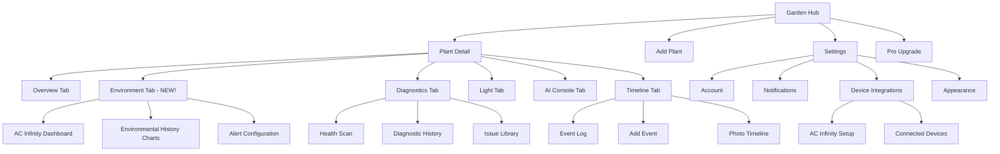
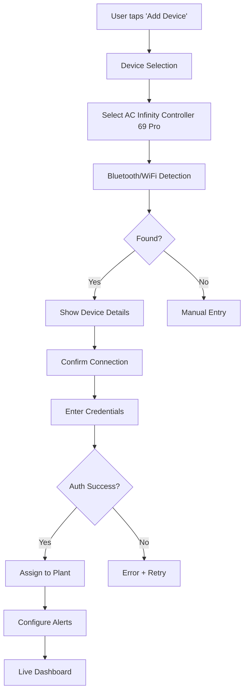
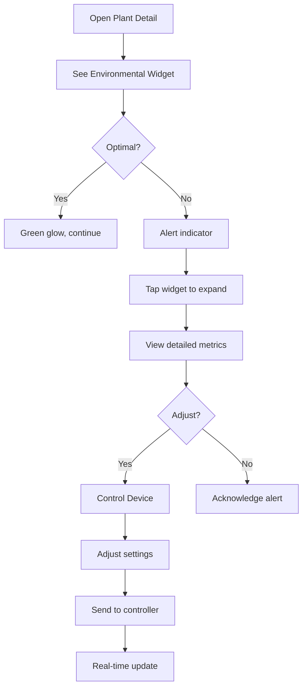
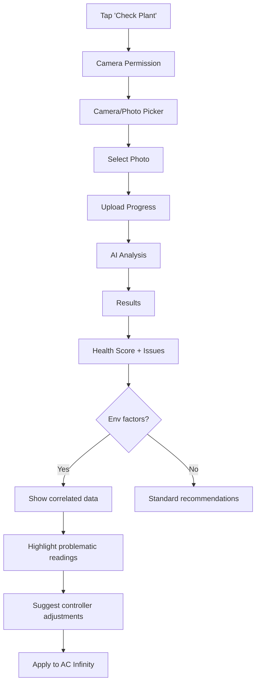

# GroBro - Smart Greenhouse UI/UX Specification

**Version:** 1.0
**Date:** 2025-11-15
**Design Direction:** Smart Greenhouse (Tech-Forward · Data-Driven · Futuristic)

---

## Introduction

This document defines the user experience goals, visual design system, component library, and screen specifications for transforming GroBro into the **Smart Greenhouse** experience - a futuristic, tech-forward interface optimized for serious cultivators who value data, automation, and professional-grade monitoring.

**Key Features:**
- Dark-first glassmorphic design system
- Native AC Infinity Controller 69 Pro integration
- Real-time environmental monitoring dashboard
- Neon-accented data visualization
- Premium, high-tech aesthetic

---

## Overall UX Goals & Principles

### Target User Personas

**1. Tech-Savvy Home Grower**
- Loves gadgets and automation
- Wants detailed metrics and control
- Uses grow controllers and sensors
- Checks app multiple times per day
- Values data visualization and trends

**2. Commercial Cultivator**
- Manages multiple grow spaces
- Needs professional-grade monitoring
- Integrates with automation systems (AC Infinity, etc.)
- Makes decisions based on environmental data
- Requires reliability and precision

**3. Indoor Grow Enthusiast**
- Invested in quality equipment
- Enjoys the "tech + nature" intersection
- Active in grow communities online
- Wants Pro features and advanced tools
- Appreciates modern, premium design

### Usability Goals

1. **Instant Data Comprehension** - Key metrics visible at a glance with clear visual hierarchy
2. **Night-Friendly Interface** - Dark mode optimized for late-night grow room checks
3. **Device Integration Transparency** - Live controller data feels native, not bolted-on
4. **Efficient Power User Workflows** - Common tasks achievable in 2 taps or less
5. **Delightful Data Visualization** - Charts and graphs that make data exciting, not overwhelming

### Design Principles

1. **"Data is Beautiful"** - Every metric is an opportunity for stunning visualization
2. **"Dark by Default"** - Embrace dark mode as the primary aesthetic, not an afterthought
3. **"Glassomorphism > Skeuomorphism"** - Transparency, blur, and depth create modern elegance
4. **"Precision Meets Personality"** - Technical accuracy with visual flair through neon accents
5. **"Integration-First"** - AC Infinity and future devices feel like core features, not plugins

---

## Information Architecture

### Site Map



### Navigation Structure

**Primary Navigation:**
- **Garden Hub** (Home) - Glassmorphic card grid showing all plants with live status indicators
- **Tab Bar** (Plant Detail) - 6 tabs with neon underline indicator
- **Settings** - Accessible via profile icon in top-right

**Secondary Navigation:**
- **Plant Context Menu** - Long-press on plant cards for quick actions
- **Floating Action Button (FAB)** - Glowing green "+" for adding plants/events
- **Modal Sheets** - Glassmorphic bottom sheets for quick actions

**Environmental Widget:**
- Persistent mini-widget at top of Plant Detail showing live AC Infinity data
- Expandable to full Environment Tab
- Animated temperature/humidity/VPD with color-coded status

---

## User Flows

### Flow 1: AC Infinity Controller Connection

**User Goal:** Connect AC Infinity Controller 69 Pro and see live environmental data

**Entry Points:** Settings > Device Integrations, Environment Tab CTA, Onboarding

**Flow Diagram:**


**Edge Cases:**
- Controller offline: Show last known data with retry option
- Multiple controllers: Display list with signal strength
- Permissions denied: Show native prompt with explanation
- Already paired: Show conflict, offer unpair
- Network interruption: Save progress, resume from last step
- Incompatible firmware: Prompt to update

---

### Flow 2: Real-Time Environmental Monitoring

**User Goal:** Check live conditions and ensure plants are optimal

**Flow Diagram:**


**Edge Cases:**
- Data delayed: Show timestamp + "Syncing..."
- Controller disconnected: Gray out controls, reconnection banner
- Extreme values: Flag as "Check Sensor"
- No history: Placeholder encouraging check-back
- Rapid changes: Smooth animations
- Multiple plants/one controller: Aggregated data with drill-down

---

### Flow 3: Plant Health Diagnostics with Environmental Context

**User Goal:** Diagnose plant issues with environmental correlation

**Flow Diagram:**


**Edge Cases:**
- Poor quality: Real-time feedback with guide
- No plant visible: Reject with tips
- AI offline: Rule-based fallback
- Conflicting symptoms: Multiple ranked possibilities
- No env data: Provide diagnostic with disclaimer
- Historical patterns: Surface trends

---

## Branding & Style Guide

### Color Palette

#### Primary Colors
| Color Type | Hex | SwiftUI | Usage |
|------------|-----|---------|-------|
| Deep Background | `#0D0F12` | `Color(hex: "0D0F12")` | Main background |
| Surface Dark | `#1A1D23` | `Color(hex: "1A1D23")` | Cards, modals |
| Surface Light | `#252930` | `Color(hex: "252930")` | Inputs, dividers |
| Electric Green | `#00FF7F` | `Color(hex: "00FF7F")` | Primary actions, health |
| Neon Green | `#39FF14` | `Color(hex: "39FF14")` | Active, success |
| Sage Green | `#52B788` | `Color(hex: "52B788")` | Muted text/icons |

#### Accent Colors
| Color Type | Hex | SwiftUI | Usage |
|------------|-----|---------|-------|
| Cyan Bright | `#00F5FF` | `Color(hex: "00F5FF")` | Water/humidity |
| Purple Neon | `#9D4EDD` | `Color(hex: "9D4EDD")` | AI/diagnostics |
| Gold Electric | `#FFD700` | `Color(hex: "FFD700")` | Pro features |

#### Semantic Colors
| Color Type | Hex | SwiftUI | Usage |
|------------|-----|---------|-------|
| Success | `#00FF7F` | `Color(hex: "00FF7F")` | Optimal, success |
| Warning | `#FF9500` | `Color(hex: "FF9500")` | Caution, limits |
| Critical | `#FF3B30` | `Color(hex: "FF3B30")` | Alerts, errors |
| Info | `#00F5FF` | `Color(hex: "00F5FF")` | Info, tips |

#### Text Colors
| Color Type | Hex | SwiftUI | Usage |
|------------|-----|---------|-------|
| Primary | `#FFFFFF` | `.white` | Headings |
| Secondary | `#A8B2C1` | `Color(hex: "A8B2C1")` | Body text |
| Tertiary | `#6B7280` | `Color(hex: "6B7280")` | Captions |
| Disabled | `#4B5563` | `Color(hex: "4B5563")` | Disabled |

### Typography

| Element | Size | Weight | Line Height | Usage |
|---------|------|--------|-------------|-------|
| H1 Hero | 34pt | Heavy (800) | 41 | Major headings |
| H2 Section | 28pt | Bold (700) | 34 | Tab titles |
| H3 Card | 22pt | Semibold (600) | 28 | Plant names |
| H4 Subsection | 18pt | Semibold (600) | 24 | Section heads |
| Body Large | 17pt | Regular (400) | 22 | Primary text |
| Body | 15pt | Regular (400) | 20 | Standard text |
| Callout | 16pt | Medium (500) | 21 | Buttons |
| Footnote | 13pt | Regular (400) | 18 | Small labels |
| Caption | 12pt | Regular (400) | 16 | Timestamps |
| Data Display | 24-48pt | Semibold (600) | 1.2 | Metrics |
| Monospace | 14-20pt | Regular (400) | 1.4 | Technical data |

**Font Families:**
- **Primary:** SF Pro Rounded (friendly, modern)
- **Data:** SF Mono (technical precision)
- **Emphasis:** SF Pro Display Heavy (impact)

### Glassmorphism Effects

**Standard Glass Card:**
```swift
.background(
    RoundedRectangle(cornerRadius: 16)
        .fill(Color(hex: "1A1D23").opacity(0.7))
        .overlay(
            RoundedRectangle(cornerRadius: 16)
                .stroke(
                    LinearGradient(
                        colors: [
                            Color(hex: "00FF7F").opacity(0.3),
                            Color(hex: "00F5FF").opacity(0.1)
                        ],
                        startPoint: .topLeading,
                        endPoint: .bottomTrailing
                    ),
                    lineWidth: 1
                )
        )
)
.background(.ultraThinMaterial)
.shadow(color: .black.opacity(0.3), radius: 20, y: 10)
```

**Active/Highlighted Card:**
- Green glow: `.shadow(color: Color(hex: "00FF7F").opacity(0.4), radius: 20)`
- Border opacity: 0.6
- Scale: `.scaleEffect(1.02)`

### Spacing & Layout

**Grid:** 4pt base unit
**Common spacing:** 8, 12, 16, 20, 24, 32, 48pt
**Safe area padding:** 16pt horizontal, 20pt vertical
**Corner radius:** 8pt (small), 12pt (medium), 16pt (large), 24pt (XL)

**Shadow System:**
```swift
// Elevation 1
.shadow(color: .black.opacity(0.2), radius: 8, y: 4)

// Elevation 2
.shadow(color: .black.opacity(0.3), radius: 16, y: 8)

// Elevation 3
.shadow(color: .black.opacity(0.4), radius: 24, y: 12)

// Neon Glow
.shadow(color: Color(hex: "00FF7F").opacity(0.4), radius: 20)
```

---

## Component Library

### 1. GlassCard

**Purpose:** Primary container for grouped content with glassmorphic styling

**Variants:**
- Standard (default opacity)
- Highlighted (green glow border)
- Elevated (higher z-index shadow)
- Compact (reduced padding)

**States:** Normal, Pressed, Disabled

**SwiftUI Implementation:**
```swift
struct GlassCard<Content: View>: View {
    let content: Content
    var isHighlighted: Bool = false

    var body: some View {
        content
            .padding(16)
            .background(
                RoundedRectangle(cornerRadius: 16)
                    .fill(Color(hex: "1A1D23").opacity(0.7))
                    .overlay(
                        RoundedRectangle(cornerRadius: 16)
                            .stroke(
                                LinearGradient(
                                    colors: isHighlighted ?
                                        [Color(hex: "00FF7F").opacity(0.6), Color(hex: "00F5FF").opacity(0.3)] :
                                        [Color(hex: "00FF7F").opacity(0.3), Color(hex: "00F5FF").opacity(0.1)],
                                    startPoint: .topLeading,
                                    endPoint: .bottomTrailing
                                ),
                                lineWidth: 1
                            )
                    )
            )
            .background(.ultraThinMaterial)
            .shadow(
                color: isHighlighted ? Color(hex: "00FF7F").opacity(0.4) : .black.opacity(0.3),
                radius: 20,
                y: 10
            )
    }
}
```

---

### 2. NeonButton

**Purpose:** Primary action buttons with electric green styling

**Variants:**
- Primary (filled green)
- Secondary (outlined green)
- Tertiary (text only)
- Destructive (red)

**States:** Normal, Pressed, Disabled, Loading

**SwiftUI Implementation:**
```swift
struct NeonButton: View {
    let title: String
    let action: () -> Void
    var style: ButtonStyle = .primary
    var isLoading: Bool = false

    enum ButtonStyle {
        case primary, secondary, tertiary, destructive
    }

    var body: some View {
        Button(action: action) {
            HStack(spacing: 8) {
                if isLoading {
                    ProgressView()
                        .progressViewStyle(CircularProgressViewStyle(tint: .white))
                }
                Text(title)
                    .font(.system(size: 16, weight: .medium))
            }
            .frame(maxWidth: .infinity)
            .padding(.vertical, 16)
            .background(backgroundForStyle)
            .foregroundColor(foregroundForStyle)
            .cornerRadius(12)
            .shadow(
                color: shadowColorForStyle,
                radius: 16,
                y: 4
            )
        }
        .disabled(isLoading)
    }

    private var backgroundForStyle: some View {
        Group {
            switch style {
            case .primary:
                LinearGradient(
                    colors: [Color(hex: "00FF7F"), Color(hex: "39FF14")],
                    startPoint: .topLeading,
                    endPoint: .bottomTrailing
                )
            case .secondary:
                Color.clear
            case .tertiary:
                Color.clear
            case .destructive:
                Color(hex: "FF3B30")
            }
        }
    }

    private var foregroundForStyle: Color {
        switch style {
        case .primary, .destructive:
            return Color(hex: "0D0F12")
        case .secondary, .tertiary:
            return Color(hex: "00FF7F")
        }
    }

    private var shadowColorForStyle: Color {
        switch style {
        case .primary:
            return Color(hex: "00FF7F").opacity(0.4)
        case .destructive:
            return Color(hex: "FF3B30").opacity(0.4)
        default:
            return .clear
        }
    }
}
```

---

### 3. EnvironmentalWidget

**Purpose:** Compact live environmental data display

**Variants:**
- Collapsed (one-line summary)
- Expanded (detailed metrics)

**States:**
- Optimal (green)
- Caution (orange)
- Critical (red)
- Offline (gray)

**SwiftUI Implementation:**
```swift
struct EnvironmentalWidget: View {
    let temperature: Double
    let humidity: Double
    let vpd: Double
    let status: EnvironmentStatus
    let isConnected: Bool
    @State private var isExpanded: Bool = false

    enum EnvironmentStatus {
        case optimal, caution, critical, offline

        var color: Color {
            switch self {
            case .optimal: return Color(hex: "00FF7F")
            case .caution: return Color(hex: "FF9500")
            case .critical: return Color(hex: "FF3B30")
            case .offline: return Color(hex: "6B7280")
            }
        }
    }

    var body: some View {
        GlassCard(isHighlighted: status == .optimal) {
            VStack(spacing: 12) {
                HStack {
                    Image(systemName: "antenna.radiowaves.left.and.right")
                        .foregroundColor(isConnected ? Color(hex: "00FF7F") : Color(hex: "6B7280"))

                    Text("Environment")
                        .font(.system(size: 16, weight: .semibold))
                        .foregroundColor(.white)

                    Spacer()

                    Circle()
                        .fill(status.color)
                        .frame(width: 8, height: 8)
                        .shadow(color: status.color.opacity(0.6), radius: 4)

                    Image(systemName: "chevron.down")
                        .rotationEffect(.degrees(isExpanded ? 180 : 0))
                        .foregroundColor(Color(hex: "A8B2C1"))
                }

                if isExpanded {
                    HStack(spacing: 16) {
                        MetricDisplay(
                            icon: "thermometer.medium",
                            value: String(format: "%.1f°F", temperature),
                            label: "Temp",
                            color: colorForTemperature(temperature)
                        )

                        MetricDisplay(
                            icon: "drop.fill",
                            value: String(format: "%.0f%%", humidity),
                            label: "RH",
                            color: Color(hex: "00F5FF")
                        )

                        MetricDisplay(
                            icon: "gauge.medium",
                            value: String(format: "%.2f", vpd),
                            label: "VPD",
                            color: colorForVPD(vpd)
                        )
                    }
                }
            }
        }
        .onTapGesture {
            withAnimation(.spring(response: 0.3)) {
                isExpanded.toggle()
            }
        }
    }

    func colorForTemperature(_ temp: Double) -> Color {
        if temp < 70 { return Color(hex: "00F5FF") }
        if temp < 80 { return Color(hex: "00FF7F") }
        if temp < 85 { return Color(hex: "FF9500") }
        return Color(hex: "FF3B30")
    }

    func colorForVPD(_ vpd: Double) -> Color {
        if vpd >= 0.8 && vpd <= 1.2 { return Color(hex: "00FF7F") }
        return Color(hex: "FF9500")
    }
}

struct MetricDisplay: View {
    let icon: String
    let value: String
    let label: String
    let color: Color

    var body: some View {
        VStack(spacing: 4) {
            Image(systemName: icon)
                .font(.system(size: 20))
                .foregroundColor(color)

            Text(value)
                .font(.system(size: 18, weight: .semibold, design: .monospaced))
                .foregroundColor(.white)

            Text(label)
                .font(.system(size: 11))
                .foregroundColor(Color(hex: "6B7280"))
                .textCase(.uppercase)
        }
        .frame(maxWidth: .infinity)
    }
}
```

---

### 4. PlantStatusCard

**Purpose:** Plant list item with health status and live data

**SwiftUI Implementation:**
```swift
struct PlantStatusCard: View {
    let plant: Plant
    let environmentalData: EnvironmentalData?

    var body: some View {
        GlassCard {
            HStack(spacing: 16) {
                // Plant photo with status overlay
                ZStack(alignment: .bottomTrailing) {
                    RoundedRectangle(cornerRadius: 12)
                        .fill(
                            LinearGradient(
                                colors: [Color(hex: "00FF7F").opacity(0.3), Color(hex: "52B788").opacity(0.5)],
                                startPoint: .topLeading,
                                endPoint: .bottomTrailing
                            )
                        )
                        .frame(width: 80, height: 80)

                    // Status indicator
                    Circle()
                        .fill(plant.healthStatus.color)
                        .frame(width: 20, height: 20)
                        .overlay(
                            Circle()
                                .stroke(Color(hex: "1A1D23"), lineWidth: 2)
                        )
                        .shadow(color: plant.healthStatus.color.opacity(0.6), radius: 4)
                        .offset(x: 4, y: 4)
                }

                VStack(alignment: .leading, spacing: 6) {
                    Text(plant.name)
                        .font(.system(size: 18, weight: .semibold))
                        .foregroundColor(.white)

                    Text(plant.strain ?? "Unknown Strain")
                        .font(.system(size: 14))
                        .foregroundColor(Color(hex: "A8B2C1"))

                    HStack(spacing: 12) {
                        Label {
                            Text(plant.growthStage.rawValue)
                                .font(.system(size: 12))
                        } icon: {
                            Image(systemName: "leaf.fill")
                        }
                        .foregroundColor(Color(hex: "00FF7F"))

                        Label {
                            Text("Day \(plant.daysOld)")
                                .font(.system(size: 12, design: .monospaced))
                        } icon: {
                            Image(systemName: "calendar")
                        }
                        .foregroundColor(Color(hex: "A8B2C1"))
                    }

                    // Live environmental mini-display
                    if let envData = environmentalData {
                        HStack(spacing: 8) {
                            Image(systemName: "thermometer.medium")
                                .font(.system(size: 10))
                            Text("\(Int(envData.temperature))°F")
                                .font(.system(size: 11, design: .monospaced))

                            Image(systemName: "drop.fill")
                                .font(.system(size: 10))
                            Text("\(Int(envData.humidity))%")
                                .font(.system(size: 11, design: .monospaced))
                        }
                        .foregroundColor(Color(hex: "00F5FF"))
                    }
                }

                Spacer()

                Image(systemName: "chevron.right")
                    .foregroundColor(Color(hex: "6B7280"))
            }
        }
    }
}
```

---

### 5. DataVisualizationChart

**Purpose:** Glassmorphic chart container for environmental trends

**Variants:**
- Line chart (temperature over time)
- Bar chart (event frequency)
- Area chart (VPD ranges)

**SwiftUI Implementation:**
```swift
import Charts

struct DataVisualizationChart: View {
    let dataPoints: [EnvironmentalDataPoint]
    let title: String
    let metricType: MetricType

    enum MetricType {
        case temperature, humidity, vpd

        var color: Color {
            switch self {
            case .temperature: return Color(hex: "00FF7F")
            case .humidity: return Color(hex: "00F5FF")
            case .vpd: return Color(hex: "9D4EDD")
            }
        }

        var icon: String {
            switch self {
            case .temperature: return "thermometer.medium"
            case .humidity: return "drop.fill"
            case .vpd: return "gauge.medium"
            }
        }
    }

    var body: some View {
        GlassCard {
            VStack(alignment: .leading, spacing: 16) {
                HStack {
                    Image(systemName: metricType.icon)
                        .foregroundColor(metricType.color)

                    Text(title)
                        .font(.system(size: 16, weight: .semibold))
                        .foregroundColor(.white)

                    Spacer()
                }

                Chart(dataPoints) { point in
                    LineMark(
                        x: .value("Time", point.timestamp),
                        y: .value("Value", point.value)
                    )
                    .foregroundStyle(
                        LinearGradient(
                            colors: [metricType.color, metricType.color.opacity(0.5)],
                            startPoint: .top,
                            endPoint: .bottom
                        )
                    )
                    .lineStyle(StrokeStyle(lineWidth: 3, lineCap: .round))

                    AreaMark(
                        x: .value("Time", point.timestamp),
                        y: .value("Value", point.value)
                    )
                    .foregroundStyle(
                        LinearGradient(
                            colors: [metricType.color.opacity(0.3), metricType.color.opacity(0.05)],
                            startPoint: .top,
                            endPoint: .bottom
                        )
                    )
                }
                .chartXAxis {
                    AxisMarks(stroke: StrokeStyle(lineWidth: 0.5, dash: [2, 2])) { _ in
                        AxisValueLabel()
                            .foregroundStyle(Color(hex: "6B7280"))
                    }
                }
                .chartYAxis {
                    AxisMarks(stroke: StrokeStyle(lineWidth: 0.5, dash: [2, 2])) { _ in
                        AxisValueLabel()
                            .foregroundStyle(Color(hex: "6B7280"))
                    }
                }
                .frame(height: 200)
            }
        }
    }
}

struct EnvironmentalDataPoint: Identifiable {
    let id = UUID()
    let timestamp: Date
    let value: Double
}
```

---

## Key Screen Redesigns

### 1. Garden Hub (Home Screen)

**Purpose:** Overview of all plants with live status monitoring

**Layout:**
```
┌─────────────────────────────────────┐
│  ☰  My Garden              [+] [⚙️] │ ← Navigation bar with glassmorphic blur
├─────────────────────────────────────┤
│                                     │
│  🌱 3 Plants  |  💧 2 Need Water    │ ← Quick stats banner
│                                     │
├─────────────────────────────────────┤
│  ┌───────────────────────────────┐  │
│  │ [Plant Card 1]                │  │ ← Glassmorphic cards
│  │  🌿 Nakisha                   │  │   with live env data
│  │  Flowering • Day 45           │  │
│  │  🌡️ 78°F  💧 60%  ⚡ Connected │  │
│  └───────────────────────────────┘  │
│                                     │
│  ┌───────────────────────────────┐  │
│  │ [Plant Card 2]                │  │
│  │  🌿 Blue Dream                │  │
│  │  Vegetative • Day 28          │  │
│  │  🌡️ 75°F  💧 55%  ⚠️ High Temp │  │
│  └───────────────────────────────┘  │
│                                     │
│  ┌───────────────────────────────┐  │
│  │ [Plant Card 3]                │  │
│  └───────────────────────────────┘  │
│                                     │
└─────────────────────────────────────┘
       ↑ FAB (+) for quick add
```

**Key Features:**
- Dark gradient background (#0D0F12 → #1A1D23)
- Glassmorphic plant cards with neon green borders
- Live environmental data inline (temp/humidity from AC Infinity)
- Status indicators with colored glows (green/orange/red)
- Floating action button with neon green glow
- Pull-to-refresh with electric green spinner

---

### 2. Plant Detail - Environment Tab (NEW!)

**Purpose:** Real-time AC Infinity controller dashboard

**Layout:**
```
┌─────────────────────────────────────┐
│  ← Nakisha                          │
├─────────────────────────────────────┤
│  ┌───────────────────────────────┐  │
│  │ 🔗 AC Infinity Controller 69  │  │ ← Connection status card
│  │ ✓ Connected • Last sync: 2s   │  │
│  └───────────────────────────────┘  │
│                                     │
│  ┌─────────────┬─────────────────┐  │
│  │   🌡️ 78.4°F │    💧 62%      │  │ ← Large metric displays
│  │  Temperature │   Humidity     │  │   with color zones
│  │  ┌─────────┐ │  ┌─────────┐  │  │
│  │  │█████▒▒▒▒│ │  │██████▒▒▒│  │  │ ← Progress bars
│  │  └─────────┘ │  └─────────┘  │  │
│  └─────────────┴─────────────────┘  │
│                                     │
│  ┌───────────────────────────────┐  │
│  │      📊 VPD: 1.15 kPa        │  │ ← VPD calculation
│  │      ✅ Optimal Range         │  │   with status
│  └───────────────────────────────┘  │
│                                     │
│  ┌───────────────────────────────┐  │
│  │  24-Hour Trend                │  │ ← Glassmorphic chart
│  │  [Line Chart Visualization]   │  │
│  │                               │  │
│  └───────────────────────────────┘  │
│                                     │
│  🎛️ Controller Settings             │ ← Quick controls
│  ┌───────────────────────────────┐  │
│  │ Fan Speed:  [━━━━●▒▒▒] 60%   │  │
│  │ Target Temp: 75-80°F          │  │
│  │ Target RH: 55-65%             │  │
│  └───────────────────────────────┘  │
│                                     │
│  [Configure Alerts]  [View History]│
│                                     │
└─────────────────────────────────────┘
│ Overview | 💧 | 🔬 | ☀️ | 🤖 | 📖 │ ← Tab bar
└─────────────────────────────────────┘
```

**Key Features:**
- Real-time data updates with smooth animations
- Color-coded metric zones (optimal/caution/critical)
- VPD calculated automatically with explanation
- Interactive charts with neon glow paths
- Direct controller adjustment sliders
- Alert threshold configuration
- Historical data visualization (24hr/7day/30day)

---

### 3. Plant Detail - Diagnostics Tab

**Purpose:** AI-powered plant health analysis with environmental correlation

**Layout:**
```
┌─────────────────────────────────────┐
│  ← Nakisha                          │
├─────────────────────────────────────┤
│  ┌───────────────────────────────┐  │
│  │   🩺 Plant Health Check       │  │
│  │                               │  │
│  │  Take a photo to check for    │  │
│  │  potential issues like        │  │
│  │  hydration, stress, pests     │  │
│  │                               │  │
│  │   [📷 Check Plant]            │  │ ← Large neon green button
│  └───────────────────────────────┘  │
│                                     │
│  📋 Recent Diagnostics              │
│  ┌───────────────────────────────┐  │
│  │ ✅ Healthy • 2 hours ago      │  │ ← Result cards with
│  │ [Thumbnail] Confidence: 95%   │  │   status indicators
│  │ 🌡️ Env: Optimal at scan time  │  │
│  └───────────────────────────────┘  │
│                                     │
│  ┌───────────────────────────────┐  │
│  │ ⚠️ Light Stress • 2 days ago  │  │
│  │ [Thumbnail] Confidence: 78%   │  │
│  │ 🌡️ Temp was 85°F (High)       │  │ ← Environmental context
│  └───────────────────────────────┘  │
│                                     │
└─────────────────────────────────────┘
│ Overview | 💧 | 🔬 | ☀️ | 🤖 | 📖 │
└─────────────────────────────────────┘
```

**After Analysis Screen:**
```
┌─────────────────────────────────────┐
│  ← Diagnostic Results               │
├─────────────────────────────────────┤
│  ┌───────────────────────────────┐  │
│  │  [Plant Photo Preview]        │  │ ← Full-width photo
│  │                               │  │
│  └───────────────────────────────┘  │
│                                     │
│  ┌─────────────────┐                │
│  │  ✅ 92%         │                │ ← Large health score
│  │  Healthy        │                │   with color coding
│  └─────────────────┘                │
│                                     │
│  🔍 Analysis                        │
│  ┌───────────────────────────────┐  │
│  │ ✅ Hydration: Good            │  │
│  │ ✅ Leaf Color: Healthy        │  │
│  │ ⚠️ Light Stress: Mild         │  │ ← Issue list
│  │ ✅ Pest/Disease: None         │  │
│  └───────────────────────────────┘  │
│                                     │
│  🌡️ Environmental Context           │
│  ┌───────────────────────────────┐  │
│  │ At time of scan:              │  │
│  │ • Temp: 82°F (Slightly High)  │  │ ← Correlated env data
│  │ • Humidity: 45% (Low)         │  │
│  │ • VPD: 1.45 kPa (High)        │  │
│  │                               │  │
│  │ ⚠️ Low humidity may be        │  │ ← AI recommendation
│  │    contributing to stress     │  │
│  │                               │  │
│  │ [Adjust Controller]           │  │ ← Direct action
│  └───────────────────────────────┘  │
│                                     │
│  [Save to Timeline] [Ask AI More]  │
└─────────────────────────────────────┘
```

**Key Features:**
- Camera interface with grid overlay guides
- Real-time photo quality feedback
- Animated analysis with scanning effect
- Health score with neon glow based on result
- Environmental data correlation
- Direct link to adjust AC Infinity settings
- Save diagnostic to timeline
- Ask AI Console follow-up questions

---

### 4. Settings - Device Integrations

**Purpose:** Manage AC Infinity and future device connections

**Layout:**
```
┌─────────────────────────────────────┐
│  ← Settings                         │
├─────────────────────────────────────┤
│  Device Integrations                │
│                                     │
│  ┌───────────────────────────────┐  │
│  │ 🔗 Connected Devices (1)      │  │
│  └───────────────────────────────┘  │
│                                     │
│  ┌───────────────────────────────┐  │
│  │ 📡 AC Infinity Controller 69  │  │ ← Device card
│  │                               │  │
│  │ ✅ Connected                  │  │
│  │ Signal: Excellent             │  │
│  │ Firmware: v2.1.4              │  │
│  │                               │  │
│  │ Assigned to: Nakisha          │  │
│  │ Last sync: 5 seconds ago      │  │
│  │                               │  │
│  │ [Configure] [Remove]          │  │
│  └───────────────────────────────┘  │
│                                     │
│  ┌───────────────────────────────┐  │
│  │ ➕ Add New Device             │  │ ← Add button
│  └───────────────────────────────┘  │
│                                     │
│  Available Integrations             │
│  ┌───────────────────────────────┐  │
│  │ AC Infinity Controllers       │  │ ← Future integrations
│  │ Support for Controller 69 Pro │  │
│  └───────────────────────────────┘  │
│                                     │
│  ┌───────────────────────────────┐  │
│  │ Vivosun Controllers           │  │
│  │ Coming Soon                   │  │
│  └───────────────────────────────┘  │
│                                     │
└─────────────────────────────────────┘
```

**Key Features:**
- List of connected devices with status
- Signal strength indicator
- Firmware version display
- Plant assignment management
- Device configuration access
- Add device wizard
- Future integration previews

---

## Animation & Micro-interactions

### Motion Principles

1. **Purposeful Motion** - Every animation serves a function (feedback, guidance, or delight)
2. **Electric Energy** - Use spring animations with slight bounce for "alive" feel
3. **Smooth Transitions** - 60fps minimum, no janky state changes
4. **Glow & Pulse** - Neon elements subtly pulse to indicate activity
5. **Respect Reduced Motion** - Honor accessibility preferences

### Key Animations

1. **Connection Pulse Animation**
   - **What:** Antenna icon pulses when syncing with AC Infinity
   - **Duration:** 1.5s
   - **Easing:** `.easeInOut` with repeat
   - **Implementation:**
   ```swift
   Image(systemName: "antenna.radiowaves.left.and.right")
       .symbolEffect(.pulse, isActive: isSyncing)
       .foregroundStyle(Color(hex: "00FF7F"))
   ```

2. **Data Value Update**
   - **What:** Smooth counter animation when environmental values change
   - **Duration:** 0.3s
   - **Easing:** `.spring(response: 0.3, dampingFraction: 0.7)`
   - **Implementation:**
   ```swift
   Text("\(temperature, format: .number.precision(.fractionLength(1)))°F")
       .contentTransition(.numericText())
       .animation(.spring(response: 0.3), value: temperature)
   ```

3. **Card Appearance**
   - **What:** Cards fade in and slide up when appearing
   - **Duration:** 0.4s
   - **Easing:** `.spring(response: 0.4, dampingFraction: 0.8)`
   - **Implementation:**
   ```swift
   .transition(.asymmetric(
       insertion: .move(edge: .bottom).combined(with: .opacity),
       removal: .opacity
   ))
   ```

4. **Status Indicator Glow**
   - **What:** Status circles pulse with colored glow
   - **Duration:** 2s
   - **Easing:** `.easeInOut` with repeat
   - **Implementation:**
   ```swift
   Circle()
       .fill(statusColor)
       .shadow(color: statusColor.opacity(0.6), radius: isAnimating ? 8 : 4)
       .onAppear {
           withAnimation(.easeInOut(duration: 2).repeatForever()) {
               isAnimating = true
           }
       }
   ```

5. **Tab Transition**
   - **What:** Tab content slides horizontally with fade
   - **Duration:** 0.3s
   - **Easing:** `.easeInOut`
   - **Implementation:**
   ```swift
   TabView(selection: $selectedTab) {
       // tabs
   }
   .tabViewStyle(.page(indexDisplayMode: .never))
   ```

6. **Chart Line Drawing**
   - **What:** Chart lines draw from left to right on appearance
   - **Duration:** 1.0s
   - **Easing:** `.easeOut`
   - **Implementation:**
   ```swift
   .onAppear {
       withAnimation(.easeOut(duration: 1.0)) {
           animateChart = true
       }
   }
   ```

7. **Alert Banner Slide**
   - **What:** Alert banners slide down from top
   - **Duration:** 0.4s
   - **Easing:** `.spring(response: 0.4, dampingFraction: 0.75)`

8. **FAB Bounce**
   - **What:** Floating action button bounces on long press
   - **Duration:** 0.2s
   - **Easing:** `.spring(response: 0.2, dampingFraction: 0.5)`

9. **Diagnostic Scan Effect**
   - **What:** Scanning line moves across photo during analysis
   - **Duration:** 2.0s
   - **Easing:** `.linear` with repeat

10. **Success Celebration**
    - **What:** Green particle burst on successful actions
    - **Duration:** 0.8s
    - **Easing:** `.easeOut`

---

## Accessibility Requirements

### Compliance Target

**Standard:** WCAG 2.1 Level AA compliance
**Platform:** iOS Accessibility Guidelines (VoiceOver, Dynamic Type, etc.)

### Key Requirements

#### Visual
- **Color Contrast:**
  - Primary text (white) on dark background: 15.1:1 (AAA)
  - Electric green (#00FF7F) on dark: 7.2:1 (AA)
  - All interactive elements meet 3:1 contrast minimum
  - Never use color alone to convey information

- **Focus Indicators:**
  - Neon green outline (2pt) on focused elements
  - Increased scale (1.05x) for buttons on focus
  - `.accessibilityShowsLargeContentViewer()` on key metrics

- **Text Sizing:**
  - Support Dynamic Type (all text)
  - Minimum touch target: 44x44pt
  - Readable at 200% zoom

#### Interaction
- **Keyboard Navigation:**
  - Full keyboard support for all actions
  - Tab order follows visual hierarchy
  - Escape key dismisses modals

- **Screen Reader:**
  - Meaningful `.accessibilityLabel` on all interactive elements
  - `.accessibilityHint` for non-obvious actions
  - `.accessibilityValue` for dynamic data (temperature, humidity)
  - Group related content with `.accessibilityElement(children: .combine)`

  **Examples:**
  ```swift
  // Environmental widget
  .accessibilityLabel("Environment status")
  .accessibilityValue("Temperature 78 degrees, Humidity 60 percent, Status optimal")
  .accessibilityHint("Double tap to view detailed environmental data")

  // Plant card
  .accessibilityLabel("Nakisha plant")
  .accessibilityValue("Flowering stage, Day 45, Temperature 78 degrees")
  .accessibilityHint("Double tap to view plant details")
  ```

- **Touch Targets:**
  - Minimum 44x44pt for all tappable elements
  - Adequate spacing between adjacent buttons (8pt minimum)

#### Content
- **Alternative Text:**
  - Plant photos: "Photo of [Plant Name] taken on [Date]"
  - Charts: Provide text summary of data trends
  - Icons: Always paired with labels or hidden from VoiceOver if decorative

- **Heading Structure:**
  - Proper heading hierarchy (H1 → H2 → H3)
  - Use `.accessibilityHeading` modifier

- **Form Labels:**
  - All inputs have associated labels
  - Error messages announced via `.accessibilityAnnouncement`

### Reduced Motion Support

```swift
@Environment(\.accessibilityReduceMotion) var reduceMotion

// Use in animations
.animation(reduceMotion ? .none : .spring(), value: someValue)

// Disable decorative animations
if !reduceMotion {
    // Pulse effects, particles, etc.
}
```

### Testing Strategy

1. **VoiceOver Testing:**
   - Navigate entire app with VoiceOver
   - Verify all content is accessible
   - Test with screen curtain enabled

2. **Dynamic Type Testing:**
   - Test at accessibility sizes (AX1-AX5)
   - Verify layouts don't break at 200% scale
   - Check for text truncation

3. **Color Blindness Testing:**
   - Use simulator filters (Protanopia, Deuteranopia, Tritanopia)
   - Verify status indicators work without color alone

4. **Contrast Testing:**
   - Validate all text meets WCAG AA standards
   - Use Xcode Accessibility Inspector

5. **Reduce Motion Testing:**
   - Enable Reduce Motion in settings
   - Verify critical animations are disabled or simplified

---

## Performance Considerations

### Performance Goals

- **App Launch:** < 1.5s to interactive on iPhone 13+
- **Screen Transition:** < 300ms perceived latency
- **Chart Rendering:** 60fps minimum (120fps on ProMotion)
- **Live Data Update:** < 100ms from AC Infinity API response to UI update
- **Image Loading:** Progressive JPEG with blur-up placeholder
- **Animation FPS:** Locked 60fps (or 120fps on capable devices)

### Design Strategies

#### 1. Lazy Loading & Virtualization

```swift
// Use LazyVStack for plant lists
LazyVStack(spacing: 16) {
    ForEach(plants) { plant in
        PlantStatusCard(plant: plant)
    }
}

// Pagination for large event timelines
```

#### 2. Image Optimization

- Use `.resizable().aspectRatio(contentMode: .fill)` with frame limits
- Implement thumbnail generation for plant photos (max 800px)
- Cache processed images with URLCache
- Progressive loading with blur placeholder

```swift
AsyncImage(url: plant.photoURL) { phase in
    switch phase {
    case .empty:
        ProgressView()
            .frame(width: 80, height: 80)
    case .success(let image):
        image
            .resizable()
            .aspectRatio(contentMode: .fill)
    case .failure:
        PlaceholderGradient()
    @unknown default:
        EmptyView()
    }
}
```

#### 3. Chart Performance

- Limit data points to 100 max (downsample if needed)
- Use `.chartXScale(domain: visibleRange)` to window data
- Debounce real-time updates (max 1 update per second)
- Pre-calculate gradients and reuse

#### 4. Animation Performance

- Use `.drawingGroup()` for complex glassmorphic cards with many layers
- Limit simultaneous animations (max 3-4 elements animating)
- Use `.animation(.default, value:)` instead of implicit animations
- Disable decorative animations on older devices (< A14 Bionic)

```swift
// Device capability check
if ProcessInfo.processInfo.processorCount >= 6 {
    // Enable advanced effects
}
```

#### 5. Background Blur Optimization

- Use `.ultraThinMaterial` instead of custom blur
- Limit nested blur layers (max 2 levels)
- Reduce blur radius on lower-end devices

#### 6. Network & Data

- Cache AC Infinity data locally (update every 5s when active)
- Use WebSocket for live data instead of polling
- Implement exponential backoff for failed requests
- Show stale data with timestamp while fetching

#### 7. Memory Management

- Release cached images when not visible
- Limit in-memory chart history (24hr max)
- Use `@StateObject` appropriately (not recreating on every render)
- Profile with Instruments to find leaks

---

## Next Steps

### Immediate Actions

1. **Design Review Meeting**
   - Present Smart Greenhouse spec to stakeholders
   - Get feedback on glassmorphic aesthetic
   - Validate AC Infinity integration approach
   - Confirm dark-first design direction

2. **Create High-Fidelity Mockups**
   - Design key screens in Figma
   - Create interactive prototype for user testing
   - Design AC Infinity connection wizard flow
   - Mock up environmental dashboard with live data

3. **AC Infinity API Integration Research**
   - Review AC Infinity Controller 69 Pro API documentation
   - Determine authentication requirements
   - Identify available data points (temp, humidity, fan speed, etc.)
   - Test API latency and reliability

4. **Component Library Development**
   - Start with GlassCard foundation component
   - Build NeonButton with all variants
   - Create EnvironmentalWidget with animations
   - Develop DataVisualizationChart wrapper

5. **Accessibility Audit**
   - Run automated accessibility checks on mockups
   - Plan VoiceOver testing strategy
   - Create accessibility testing checklist

6. **Performance Baseline**
   - Profile current app performance
   - Establish metrics for glassmorphic rendering
   - Test animation performance on older devices (iPhone 12, iPhone SE)

### Design Handoff Checklist

- [x] All user flows documented
- [x] Component inventory complete
- [x] Accessibility requirements defined
- [x] Responsive strategy clear (iOS only, but iPhone/iPad variants)
- [x] Brand guidelines established (Smart Greenhouse aesthetic)
- [x] Performance goals set
- [ ] High-fidelity mockups created
- [ ] Interactive prototype built
- [ ] Design system documented in Figma
- [ ] Component specs handed off to developers
- [ ] AC Infinity integration workflow validated
- [ ] User testing completed

### Open Questions

1. **AC Infinity API Access**
   - Do we have API credentials yet?
   - What's the rate limit for requests?
   - Can we use WebSockets for real-time data?

2. **Device Support**
   - Should we support iOS 17 or keep iOS 18+ minimum?
   - Do we need iPad-specific layouts?
   - Will there be an Apple Watch companion?

3. **Pro Features**
   - Is environmental monitoring a Pro feature or free?
   - Should controller integration require Pro subscription?
   - What's the limit for free tier (1 controller vs unlimited)?

4. **Data Privacy**
   - Where is AC Infinity data stored (local vs cloud)?
   - Do we cache environmental history locally?
   - What's the data retention policy?

5. **Future Integrations**
   - Priority order for other controller brands (Vivosun, etc.)?
   - Should we plan for multi-device support (multiple controllers)?
   - Any plans for camera/timelapse integration?

---

## Change Log

| Date | Version | Description | Author |
|------|---------|-------------|--------|
| 2025-11-15 | 1.0 | Initial Smart Greenhouse design specification created | Sally (UX Expert) |

---

## Appendix: Color Hex Reference

Quick reference for developers:

```swift
// Primary Palette
extension Color {
    static let deepBackground = Color(hex: "0D0F12")
    static let surfaceDark = Color(hex: "1A1D23")
    static let surfaceLight = Color(hex: "252930")
    static let electricGreen = Color(hex: "00FF7F")
    static let neonGreen = Color(hex: "39FF14")
    static let sageGreen = Color(hex: "52B788")

    // Accents
    static let cyanBright = Color(hex: "00F5FF")
    static let purpleNeon = Color(hex: "9D4EDD")
    static let goldElectric = Color(hex: "FFD700")

    // Semantic
    static let successGreen = Color(hex: "00FF7F")
    static let warningOrange = Color(hex: "FF9500")
    static let criticalRed = Color(hex: "FF3B30")
    static let infoCyan = Color(hex: "00F5FF")

    // Text
    static let primaryText = Color.white
    static let secondaryText = Color(hex: "A8B2C1")
    static let tertiaryText = Color(hex: "6B7280")
    static let disabledText = Color(hex: "4B5563")
}

// Helper for hex init
extension Color {
    init(hex: String) {
        let hex = hex.trimmingCharacters(in: CharacterSet.alphanumerics.inverted)
        var int: UInt64 = 0
        Scanner(string: hex).scanHexInt64(&int)
        let a, r, g, b: UInt64
        switch hex.count {
        case 3: // RGB (12-bit)
            (a, r, g, b) = (255, (int >> 8) * 17, (int >> 4 & 0xF) * 17, (int & 0xF) * 17)
        case 6: // RGB (24-bit)
            (a, r, g, b) = (255, int >> 16, int >> 8 & 0xFF, int & 0xFF)
        case 8: // ARGB (32-bit)
            (a, r, g, b) = (int >> 24, int >> 16 & 0xFF, int >> 8 & 0xFF, int & 0xFF)
        default:
            (a, r, g, b) = (1, 1, 1, 0)
        }

        self.init(
            .sRGB,
            red: Double(r) / 255,
            green: Double(g) / 255,
            blue:  Double(b) / 255,
            opacity: Double(a) / 255
        )
    }
}
```

---

**End of Smart Greenhouse UI/UX Specification**
